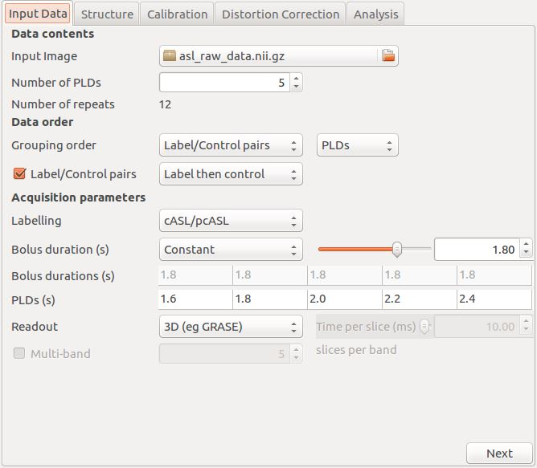
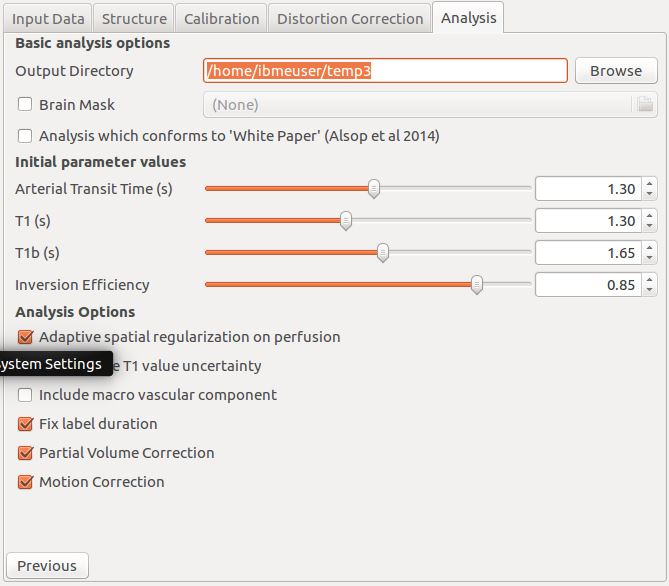
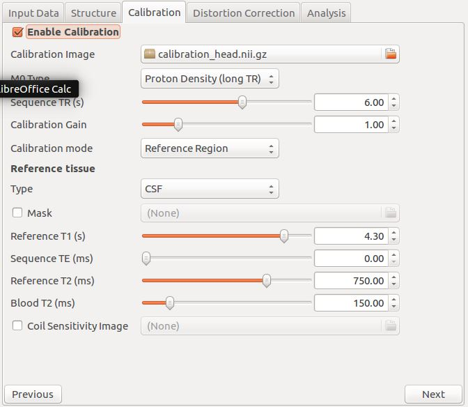

================
Oxford ASL User Guide
================

Kinetic analysis concepts
=========================

BASIL permits various options to be applied when performing the kinetic model-based analysis, here some conceptual details of these options are given. Note that the way you choose these options varies between the different tools (see the individual guides for more information).

Definition of inversion time
----------------------------

Inversion time (commonly quoted for pASL) is defined as the time from the start of labelling to time of image acquisition. Often for cASL or pcASL the 'post labelling delay' is quoted and is the time from the end of the labelling until image acquisition. Thus::

    cASL or pcASL: TI = PLD + Labelling duration

This distinction does not arise in pASL, since the labelling is instantaneous.

Bolus duration
--------------

Although some ASL sequences fix the temporal duration of the bolus, e.g. QUIPSS2, due to dispersion it is still feasible that the actual bolus length may vary across the brain. BASIL can take this into account by inferring the bolus length directly from the data and Oxford_asl does this by default. Even if you infer the bolus duration you should set a guess for the bolus duration as determined by you sequence. NOTE if your sequence results in an effectively infinite bolus length, e.g. FAIR, then there still might be a justification for inferring a finite bolus length depending upon the extent of the coil used for tagging. In which case you should set the bolus duration to some reasonable value (less than the last TI).

For a cASL or pcASL acquisition the bolus duration will be set by the duration for which labeling was applied. Thus it is reasonable to fix the 'bolus duration' parameter to that value.

Macro vascular (arterial) contribution
--------------------------------------

If flow crushing has not been used then there may be significant signal from labeled arterial blood in the region of major vessels in the ASL data, for more information see Chappell et al., MRM, 2010. This is usually only an issue in short inversion time or post label delay images. For single delay ASL the issue is often avoided by chosing a suitably long delay such that label will have already passed into the capillary bed.For multi delay data the macro vaslcuar signal can be accounted for by modelling this arterial component (by default oxford_asl includes this component). When the macro vascular component is included in the analysis then a further parameter, the arterial blood volume, is available from the analysis.

T1 values
---------

T1 values are important to the kinetic model inversion and should be chosen based on the field strength that data was acquired at, consideration might also need to be taken of the subject in which analysis is being carried out. BASIL by deafult takes values for 3T and assumes for the tissue only a grey matter value, unless partial volume correction is applied when separate grey and white matter values are specified.

Commonly it is assumed that T1 and T1b take a fixed value in the kinetic curve model. However, this value is not absolutely certain and may well vary across the brain. BASIL can take this into account by inferring on T1 and T1b, you should still, however, set sensible expected T1 and T1b values. NOTE: maps of T1 and T1b produced by this process are unlikely to be accurate measures of T1 in the brain - ASL data is not suitable for this. The purpose of including T1 and T1b in the inference is primarily to take account of their varaibility when estimating the other parameters. An exception to this is QUASAR data (in quasil) where a T1 image is estimated from the saturation recovery of the control data (and subsequently applied to the kinetic curve fitting).

Registration
------------

Registration of ASL data to the structural image is difficult since the images are low resolution and with limited contrast. By default in oxford_asl registration is carried out in multiple steps using the supplied ASL difference data, this is often sub optimal. A better result can be obtained by using the perfusion image directly to perform registration after the BASIL analysis. However, a far better option is generally to use the raw (undifferenced) ASL data as a basis for registration and the --regfrom option in oxford_asl exists for this purpose. The GUI will automatically try to use the raw data as the basis for registration for this reason.

Performing fast analysis
------------------------

By default BASIL does analysis in multiple steps adding new parameters a few at a time in separate analysis steps. It is possible to perform the analysis in a single step if you are using the basil command line tool, producing results more quickly. The result is likely to be less robust than the multi-step analysis when there are a large number of parameters in the model, i.e. if you are using all the inference options. It is, however, normally pretty stable in combination with spatial priors for most analysis problems. Thus you might want to use this to check the data, but use multiple steps for the very final result.

Spatial regularization
----------------------

BASIL can apply a spatial smoothing prior to the estimated CBF image, for more information see Groves 'et al', NeuroImage, 2009. This exploits the fact that neighboring voxels are likely to have similar CBF values, i.e. CBF variation in the brain is relatively smooth. It brings the advantages associated with the more common pre-processing step of spatially smoothing the data. However, unlike smoothing the data it correctly preserves the non-linear kinetics exploited by the CBF estimation. It is also adaptive, so that in regions where the data does not support the use of smoothing the CBF image will not be smoothed. The spatial priors can be combined with the fast analysis option to achieve rapid results with a good level of robustness to noise.

Partial volume correction
-------------------------

The low resolution of ASL data typically means that there is substantial partial voluming of grey (GM) and white matter (WM), plus CSF too. Since GM and WM have very different kinetics (WM tends to have lower CBF and longer arrival times) a normal analysis will provide a CBF that is something of a combination of the two tissue types. BASIL can attempt to automatically correct for the different tissue types, for more details see Chappell et al., MRM, 2011. Currently oxford_asl can try to do this automatically as long as you supply a structural image, but this implementation is still in beta.

A more fully tested implementation is available though the basil command line tool. For this you need to provide partial volume estimates (PVE) at the same resolution as the ASL data. PVE can be obtained from a structural image, for example using FAST, the high resolution PVE image can then be converted using a transformation matrix from the structural to ASL image spaces, (obtained for example using asl_calib or FLIRT). This step is best done using applywarp to unsure that the values are the total PVE within the voxel, something like::

    applywarp --ref={asl_data} --in={PV_estimate_image} --out={PV_estimate_low_res} 
              --premat={structural_to_ASL_tranformation_matrix} --super --interp=spline 
              --superlevel=4

Single delay data
=================

BASIL was designed to make the most of the information available with multi delay data. With single delay measurements it is not possible to account for variation in bolus arrival time (BAT) and other parameters that are included in the kinetic model. However, if you assume a value for the BAT and other parameters then a CBF value can be determined using the kinetic model. BASIL will work with single delay data and will return the appropriate CBF image, the BAT value can be chosen for the analysis (the default is 0.7). BASIL may be advantageous for single TI data (over simply inverting the relevant model directly) when employing the spatial priors option (the fast option can be used at the same time) or when using partial volume correction.

If you have a dataset containing just a single TI you will most probably have a whole series of volumes which are pairs of tag and control images where the measurement has been repeated a number of times to improve the signal-to-noise ratio of the final data. This can simply be fed into Asl_gui to perform perfusion estimation. Otherwise to get a perfusion image you need to do tag-control subtraction and then take the average of these 'difference' images. This can be achieved neatly using asl_file::

    asl_file --data={raw_data} --ntis=1 --iaf=tc --diff --mean={output_name}

This will provide an image of (relative) perfusion in the same units as the original data. If you want absolute perfusion you will need both an estimate of the M0 of blood and to apply an inverted version of the kinetic model. The latter can be achieved using oxford_asl or BASIL, the former may be possible from the raw data (assuming you do not have background suppressed data) or a separate calibration image using oxford_asl or asl_calib.

Asl_gui
=======

The graphical user interface to the BASIL tools can be accessed by typing either Asl (linux) or Asl_gui (OS X) at the command line. It should provide most of the options required for analysis of ASL data inlcuding the majority of the more advanced features of BASIL.

Note: Asl_gui was only officially released with FSL 5.0.3 (any previous versions are unlikely to be very stable and will not adhere to the documentation here). This is still a beta version, we expect to add further features and refine the interface for a future release.

Note: Changes in oxford_asl in FSL 5.0.6 also apply to asl_gui - namely that inversion efficiency is now included in the calculation (using default values) and that structural images shoud have been brain extracted before input to asl_gui.

Asl_gui has four tabs, whose function are fairly obvious:

- Data: Specify details of the ASL data here, as well as any supplementary data such as a structural image.
- Analysis: Options relating to the analysis, primarily the kinetic model and the estimation process.
- Registration: Options relating to the registration of the results to the structural image.
- Calibration: Options relating to the estimation of M0a (the equilibrium magnetization of arterial blood) for absolute quantification of pefusion.

More details on each tab are provided below. Note that some of the options available on each tab depend on what information is present in your data (set on the data tab). Thus your view of the tab might differ from the one shown here slightly.

Data
----

- Input Filename: Select here the ASL data file - it should be a single 4D nifti file, with the individual measurements in the 4th dimension
- Inversion Times: The inversion times present in the data as a comma separated list. If the data contains multiple repeats of the same indiviual/set of inversion times then it is only necessary to list this once.
- Bolus duration: For cASL/pcASL this is the labeling duration, for pASL this is the assumed value for the bolus duration that may have been set by a QUIPSSII method or otherwise a reasonable estimate of its value (usually int he range 1-1.5s). If the bolus duration has not be fixed by the acquisition then estimating its value from the data should be selected on the analysis tab.
- Labeling: Choose the labelling scheme employed.
- Data is tag-control pairs: Instructs BASIL to do tag control subtraction on the data, turn off if this has already been done.
- Data order (grouped by): This is only applicable to multi delay ASL data and specifies how the different inversion times appear in the data - see the oxford_asl help section.
- Static tissue: Specify whether the static tissue has been manipulated in any way (not relevant to data that is not tag-control pairs). This determines what options are available for calibration.
- Structural image: provide a structural image to which to register the resulting images.

Analysis
--------

- Output directory: where to put the results.
- Optional brain mask: BASIL will try to create a brain mask for you using the available data. This permits you to specify your own mask.
- Output parameter variance: Instructs BASIL also to output the variance images for perfusion (and other paramters) allowing you to assess the uncertainty of estimation and pass these up into a higher-level analysis.
- Bolus arrival time: The assumed value for the BAT. For multi dealy data BAT is estimated from the data and this value is used as prior information, for single delay data this value can be treated as fixed. The default 0.7 appears to be reasonable for pASL, but logner values ~1.3s have been found to be more suitable for pcASL data.
- T1/T1b: T1 values for tissue and blood.
- Use adaptive spatial smoothing on CBF: applys a spatial prior to the perfusion image during estimation, thus making use of neighbourhood information. This is a highly recommended option, but is off by default.
- Incorporate T1 uncertainty: Permits voxelwise variability in the T1 values, this will primiarly be reflected in the variance images.
- Include macro vascular componet: Corrects for MV contamination and it suitable where the data contains multiple delays (including the case with flow suppression)
- Fix bolus duration: Takes the value from the data tab as fixed, turn off to estimate this from the data, where the value on the data tab will be used as prior information.

Registration
------------

.. image:: images/aslgui_reg.jpg

- Structural to standard space transform: a .mat from flirt that specifies the transformation from structural to 'standard' space.
- Alternate standard brain iamge: The 'standard' brain for the above transformation if MNI152 has not been used.
- Low-resolution structual image: Another structural image of lower resolution (similar to the ASL data) to be used as an intermediary for registration.

Calibration
-----------

- Perform calibration: by default M0a estimation is not done.
- Mode: either 'LongTR' or 'Saturation Recovery' - the options present here will depend upon the choice of 'static tissue' on the data tab.
- M0 calibration image (only for background suppressed data): a separate 'calibration' image to be used for M0a calculation.
- Use coil sensitivity reference image: A separate image with the same acquisition parameters as the main calibration (either image above or the control images in the ASL data) but with a different coil with flatter sensitivity that used for the main data.
- Calibration gain: Only relevant if the gain was higher for the ASL data than the calibration image, in which case this is how much higher the gain was for the ASL data (normally this might only apply for backgroudn suppressed data).
- Reference tissue: Here details of the reference tissue to used for M0a calculation are specified. Voxelwise calculation of M0a cannot be carried out using Asl_gui, use the asl_calib tool directly.
- Reference tissue type: CSF/white matter/grey matter/none. For the first three options a mask will be generated automatically from the structural image (if you have specfied one). Otherwise you have to add your own mask in the Reference Tissue Mask box. Generally CSF or white matter are good choices, avoid grey matter.
- Reference T1: T1 of the reference tissue - currently this defaults to the CSF value, so will need to be changed if you change the tissue type (see asl_calib).
- Reference T2/ Blood T2: T2 values, these are only relevant if you specify the TE of your sequence. T2 of the reference deafults to a CSF value. These should be replaced by T2* values if appropriate.
- Sequence parameters
  - TR: This is for the longTR mode and should be the Tr of the ASL sequence, unless you have a separate calibration image in which case use that TR.
  - TE: This corrects for T2 differences between the reference tissue and the tissue (using a blood T2 value) using the TE of the data (which is assumed to be the same as any calibration image).

Output
------

The outputs from Asl_gui are a resting perfusion image called perfusion.nii.gz, which provides blood flow in relative (scanner) units, and an arrival time image called arrival.nii.gz. If a calibration has been performed then a further image perfusion_calib.nii.gz is also produced, which is a flow map in absolute units (ml/100g/min). Results in standard space (assuming that the transformation matrix has been supplied) will appear in the output directory directly. Results in the native space of the data and structural space (along with any transformation matrices from the registration process) will appear in their own subdirectories.

If calibration was performed then a separate subdirectory will be created and will contain text file called M0b.txt that records the estimated M0 value from arterial blood. If a reference tissue mask was not supplied then the automatically generated one will also be saved in as refmask.nii.gz

Oxford_ASL
==========

Oxford_ASL is an automated command line utility that processes ASL data to produce a calibrated map of resting state tissue perfusion. A typical usage would be::

    oxford_asl -i [asl_data] -s [struct_image] -t [struct2std_trans.mat] -c [M0_calib_image] 
               --tis 0.2,0.4,0.6,0.8,1.0,1.2,1.4,1.6,2.0,2.2

This command would process the data specified by [asl_data] with the list of inverstion times --tis used in the data collection. The resulting tissue perfusion map is registered into standard space by way of the structural image [struct_image] and structural to standard transformation matrix [struct2std_trans.mat]. Finally a calibrated perfusion map (in ml/100g/min) is produced using the calibration image [M0_calib] and an automatically generated CSF mask. In this case the output image(s) will be placed in the current directory.

This performs calibration to get CBF in physiological units using the supplied calibration image. More advanced calibration options (and the use of saturation recovery of the control images) can be achieved using asl_calib separately. Oxford_asl will try to register the resulting CBF image to the structural image if provided. It is very important to inspect whether the registration has worked by examining the final result. There are a couple of options that can improve the robustness of registration. Advanced custom registration can be done using the native_space results directly and either asl_reg or flirt.

Changes from FSL 5.0.6 onward
-----------------------------

Oxford_asl was modified in 5.0.6 to make it more consistent with the (upcoming) ASL white paper. Thus T1 values differ from the previous release and the inversion efficiency is now included by default (this can be 'turned off' by setting --alpha 1) - the new defaults for these can be found by typing oxford_asl on the command line and consulting the usage information. Oxford_asl now also expects all structural images to have already been brain extracted (in the past BET was run internally). This now leaves it up to the user to choose their preferred BET options and get the brain extraction they wish without any further modification by oxford_asl.

Output
------

The outputs from Oxford_ASL are a resting state perfusion image called perfusion.nii.gz, which provides blood flow in relative (scanner) units, and an arrival time image called arrival.nii.gz. If a calibration image has been supplied then a further image perfusion_calib.nii.gz is also produced, which is a flow map in absolute units (ml/100g/min).

If calibration was performed then a text file called M0b.txt will be created that saves the estimated M0 value from arterial blood. If a CSF mask was not supplied then the automatically generated one will also be saved in the output directory as csf_mask.nii.gz

A subdirectory is also created called native_space in which perfusion and arrival time images in the native resolution of the ASL data are saved. These are useful if you find the registration to be unsatisfactory, allowing a new registration to be performed without having to repeat the main analysis.

Usage
-----

Typing oxford_asl with no options will give the basic usage information, the following is a more detailed version:

 - ``-i [asl_data]`` this is the ASL data with the individual ASL images stacked in the time (4th) dimension. The number of volumes should match the number of TIs.
 - ``--tis TI1,TI2,TI3...`` This option specifies the list of inversion times used in the data acquisition, a comma separated list of values should be provided (that matches the order in the data). If the data contains multiple repeats of the same set of TIs then it is only necessary to list the unique TIs. In this case oxford_asl will take the mean of the values for each TI before model-fitting (if you dont want it to do this then list out all the TIs for every volume in the data explicitly).
 - ``-o (optional) [output_directory]`` use this to place the result in a different directory to the current working directory.
 - ``-s (optional) [struct_image]`` high resolution structural image (assumed to be T1 weighted or similar). If this is not provided then results will be provided in native space only.
 - ``-t (optional) [struct2std_trans.mat]`` transformation matrix that takes the structural image into standard space. This matrix is an output from the registration process carried out by FLRIT (this is a normal part of FEAT processing for fMRI data for a subject). If this is not supplied data will be output in structural space.
 - ``-S (optional) [std_image]`` use to specify the standard brain to which registration takes place - this should be the same image as was used in the production of the structural to standard transformation matrix. By default the MNI152_T1_2mm image is used, this is commonly used in other FSL tools.
 
**Acquisition specific**

 - ``--casl`` Data was acquired using cASL or pcASL labelling.
 - ``--bolus [bolus_duration]`` use this to specify the duration of the ASL tagging bolus used in the sequence (in seconds). This is assumed to be 1 second by default, the actual bolus length is estimated as part of the processing (unless you supply the --fixbolus option) - this value is used as the intial guess.
 - ``--t1 [T1_value]`` The T1 value of tissue, 1.3 s by default (assuming acquisition at 3T).
 - ``--t1b [T1b_value]`` The T1 value of arterial blood, 1.6 s by default (assuming acquisition at 3T).
 - ``--slicedt [timing_difference_value]`` For multi-slice acquisitions where superior slices are acquired later than those below. This provides the increase in time after labeling for a superior slice relative to the one directly below. It is assumed that the TIs provided refer to the lowest slice in the dataset.
 - ``--artoff`` Turn off correction for signal arising from ASL signal still within the (macro) vascualture, this might be appropriate if the acquisition employed flow suppression.
 - ``--fixbolus`` Turn off the automatic estimation of bolus duration, this might be appropriate if the bolus duration is well defined by the acquisition sequence (often true for cASL and pcASL, as well as when using pASL plus QUIPSSII).

**Calibration**

 - ``-c [M0_calib_image]`` specifies the M0 calibration image that is used to get flow values in absolute units. This should be an image with the repeated measurements stacked in the time dimension.
 - ``--csf (optional) [csf_mask]`` Image in the same space as the structural (or low res structural image if supplied) that is a mask of voxels containing CSF to be used in calibration. This is a further option of the calibration step and allows the CSF mask to be manually specified if the automated procedure fails.
 - ``--cgain (optional) [relative_gain_value]`` If the calibration image has been acquired with a different gain to the ASL data this can be specified here. For example, when using background suppression the raw ASL signal will be much smaller than the (non background suppressed) calibration image so a higher gain might be employed in the acquisition.
 - ``--t1csf (optional) [T1 value for CSF in s]`` Supply a value for the T1 of CSF to be used in the calibration process. Default values are used by asl_calib based on a 3T field strength (these can be checked by calling asl_calib at the command line).
 - ``--te (optional) [Echo time for readout in ms]`` Set the echo time for the reaodut so that T2(*) effects are taken into account in the calibration. If this is not supplied then TE = 0 ms is assumed, i.e. T2(*) effects are negligible. Default values are assumed by asl_calib for T2(*) values, you might wish to treat these with caution as these are estimates based on the literature.
 - ``--t2star (optional)`` Tells oxford_asl to correct for T2* rather than T2 effects. This simply tells asl_calib to use the default values for T2* in place of T2 in the calculations.
 - ``--t2csf (optional) [T2 value for CSF]`` Supply a value for the T2 of CSF to be used in the calibration process, only relevant if you supply the TE value. Default values are used by asl_calib based on a 3T field strength (these can be checked by calling asl_calib at the command line).
 - --t2bl (optional) [T2 value for blood] Supply a value for the T2 of blood to be used in the calibration process, only relevant if you supply the TE value. Default values are used by asl_calib based on a 3T field strength (these can be checked by calling asl_calib at the command line).

**Registration**

 - -r (optional) [low_res_struct]`` low resolution structural image used as an extra step in the registration to improve resulting transformation.
 - ``--regfrom (optional) [reg_source]`` An alternative image to use as the basis of registration. This should be the same resolution as the ASL data and aligned to it. The raw data before tag-control differencing or the calibration image are often a better reference for registration than the CBF image.

**Analysis**

 - ``--spatial`` Use spatial prior on the estimated CBF image. This exploits the spatial homogeneity (or smoothness) of the CBF image. This is somewhat similar to spatial smoothing the raw data, but it is adaptive and does not interact unfavorably with the non-linear kinetic curve modelling.
 - ``--infert1`` Incorporate uncertainty in the T1 values into the analysis.
 - ``--bat [BAT_value]`` Bolus arrival time value (in seconds). BAT is estimated directly from the data, but this option can be used to supply a different prior estimate from that used by default (0.7 seconds).

QUASIL
======

QUASIL is a special implementation of BASIL specifically designed to exploit the features of QUASAR ASL data. It uses the same two component (tissue plus macro vascular signal) model that is employed by BASIL, but it has been extended to use all the information provided by the various phases for flow suppression provided by the QUASAR sequence. QUASIL uses information from the full QUASAR dataset to produce CBF images in absolute units (using an implementation of asl_calib). QUASIL also provides the option to performed a 'model-free' analysis using a very similar methodology as presented in the original QUASAR paper.

More information on the model used can be found in:

  *Chappell, M. A., Woolrich, M. W., Petersen, E. T., Golay, X., & Payne, S. J. (2012). Comparing model-based and model-free analysis methods for QUASAR arterial spin labeling perfusion quantification. Magnetic resonance in medicine. doi:10.1002/mrm.24372*

More information on the model-free method can be found in the original QUASAR paper:

 *Petersen, E., Lim, T., & Golay, X. (2006). Model-free arterial spin labeling quantification approach for perfusion MRI. Magnetic resonance in medicine , 55(2), 219–232. doi:10.1002/mrm.20784*

Usage
-----

Since the acquisition of data using QUASAR is very well defined there are far fewer options to set with QUASIL than a typical BASIL analysis. NOTE that QUASIL expects the data without tag-control subtraction having been performed. A typical command line usage would be::

    quasil -i [asl_data] -o [output_directory]
 
This would carry out a model-based analysis of the ASL data and provide voxelwise estimates of CBF, arrival time and arterial blood volume (aBV). The calibration of the data to the equilibrium magnetization is also carried out as part of the processing so that the perfusion image is provided in absolute units (ml/100ml/min). Additionally, the perfusion image prior to calibration is also provided: perfusion_raw.

Typing quasil with no options will give basic usage information.

Extended options
----------------

 - ``-i <asl_data>`` The QUASAR ASL data in Nifti file format. The data order should 'as acquired', i.e. as blocks of TIs measured in the different phases of flow suppression.
 - ``-o (optional) [output_directory]`` use this to place the result in a different directory to the current working directory.
 - ``-m (optional) [brain_mask]`` Use this to provide a brain mask in which data analysis should take place. If this is not set a mask will be generated automatically from the data.
 - ``--mfree`` Do a 'model-free' rather than model based analysis of the data.

Calibration
-----------

The calibration is carried out by ``asl_calib`` and uses the saturation recovery of the control images. M0 of the tissue is estimated voxelwise from fitting a saturation recovery model and from this a voxelwise estimate of M0 of the blood is derived and applied to the estimated perfusion images. More details are given in the references above. An alternative is to calculate the M0 of CSF within a CSF mask and from this estimate a single value of M0 of arterial blood, as is done by ``oxford_asl`` by default. This can be achieved using ``asl_calib`` and the resulting M0 value applied to the ``perfusion_raw`` image.

Calibration (asl_calib)
=======================

ASL tag-control difference data can be used to quantify perfusion. However, the values obtained are not absolutely quantified in conventional units, to get absolute CBF quantification it is also necessary to estimate the equilibrium magnetization of arterial blood.

The M0 value for arterial blood can be estimated indirectly from a measurement in a reference 'tissue', such as the CSF, either:

 - LongTR: From a separate calibration image that uses the same acquisition as the ASL data, but contains no inversion (i.e. a 'control' image) and no background suppression. Ideally the images would be acquired with a very long TR.   However, it is possible to account for shorter TR values, for example matching that the of ASL sequence, with an estimate of the T1 of the reference 'tissue'.

 - SatRecov: From the saturation recovery of the control images in the ASL data sequence, if a presaturation has been applied in the imaging region.
   
``asl_calib`` performs the necessary steps to obtain the M0 of blood value from such a calibration images. It can also:

 - LongTR method: produce a spatial sensitivity estiamte for the coil used for aquisition, if another calibration image is supplied that was acquired using some other coil (assumed to have a flat spatial sensitivity) as a reference (e.g. the body coil).
 - SatRecov method: produce an estimated T1 of tissue image for use in kinetic curve model fitting.

asl_calib usage
---------------

Typing the asl_calib with no options will give the basic usage information, the following is a more detailed version:

- ``-c [calib_data]`` Calibration data in Nifti file format with the individual images stacked in the time dimension.
- ``-s [structural_image]`` Structural image used for determining reference 'tissue' mask (not required if reference 'tissue' mask is supplied, see below).
- ``-t [asl->structural_transformation_matrix]`` Transformation matrix for ASL images to structural image space, e.g. from asl_reg, (not required if reference 'tissue' mask is supplied, see below).
- ``--mode [mode]`` Specify what form the calibration data takes, options are: longtr, satrecov. See below for mode specific options.
- ``--tissref [Reference_tissue_type]`` The 'tissue' type to use as a reference, see below, options are: csf, wm, gm, none.
- ``- ``-te [TE_value]`` TE of the calibration sequence in seconds, deafult is 0 s.
- ``-i [CBF_image]`` A CBF image for calibration. This should be still at the native resolution of the ASL data.

Output options
--------------

- ``-o [absolute_CBF_image_name]`` File to which absolute CBF image should be saved, if input image has been supplied with -i.
- ``--Mo [M0_value_save_file]`` The estimated M0 value of arterial blood will be saved as text to a file of this name. This can then be used to convert a CBF image into absolute values.

Extended Options
----------------

- ``-m [CSF_mask]`` Provide a 'tissue' reference mask, e.g. hand drawn, instead of relying upon automated mask creation. If a mask is supplied the structural image and ASL to structural transformation are no longer required.
- ``-bmask [brain_mask]`` A mask of the brain in (ASL native space), this will be used for sensitivity estimation (LongTR method) or T1 estimation (SatRecov method). If not supplied a brain mask will be generated automatically from the calibration data if it is needed, this option allows the same mask from other processing steps to be employed for consistency.
- ``-t2star`` Tells asl_calib to do T2* correction rather than T2 correction. This option simply alters which set of default T2(*) values are used.
- ``-t1r [T1_reference_tissue]`` T1 (in seconds) for the reference tissue, the defaults for the different --tissref options are (based on 3T): csf 3.4, gm, 1.3, wm 1.0.
- ``-t2r [T2_reference_tissue]`` T2(*) (in miliseconds) for the reference tissue, the defaults for the different --tissref options are (based on 3T) T2/T2*: csf 750/500, gm, 100/50, wm 50/20. These defaults are general estimates based on the literature and should be used with care.
- ``-t2b [T2_blood]`` T2 (in miliseconds) for blood, the default is 150/50 (T2/T2*). The defaults are a general estimate based on the literature and should be used with care.

Mode specific options
---------------------

**LongTR**

- ``--tr [TR_value]`` TR of the calibration sequence in seconds, default is 3.2 s.
- ``--cagin [calibration_gain]`` The relative gain of the ASL data to that of the calibration image, default 1. This allows for the case where the ASL data has been acquired with a higher gain than the calibration images, for example where background suppression was used allowing for a higher gain to be set for the ASL data.
- ``-cref [calibration_reference_image]`` A further image squired using the same parameters as the main calibration file, but with a different coil to be used as a reference to calculate the sensitivity of the coil used for the main ASL data.
- ``-osen [sensitivity_image_out_file]`` Specify where the sensitivity file can be saved, if a reference image has been supplied with --cref. This can be used later to correct an estimated CBF image for coil sensitivity.
- ``-isen [sensitivity_image]`` provide a sensitivity image (that matches the calibration image).

**SatRecov**

- ``--tis [List_of_tis]`` Comma separated list of inversion times in the data (in seconds), e.g. ``--tis 0.2,0.4,0.6``.
- ``--fa [Flip_angle]`` Flip angle in degrees for Look-Locker readouts, do not set if not using Look-Locker.
- ``--lfa [Low_flip_angle]`` Low flip angle for Look-Lokcer readouts in which an extra set of TIs were acquired with a lower flip angle. This is used to estimate the correction for true flip angle at every voxel. It is assumed that the low flip angle data is the final phase (set of TIs) in the calibration data.
- ``--nphases [number_of_phases]`` The number of phases (sets of TIs) at the higher flip angle.

'Tissue' reference type
-----------------------

asl_calib will let you choose what 'tissue' you want to use as the reference. M0 is calculated within a mask of this 'tissue', as the mean over all the voxels within the mask. This option tells asl_calib which 'tissue' from the automatic segmentation as well as what T1 and T2(*) values should be used.

By default asl_calib uses CSF as the reference because it is relatively easy to segment and a mask can be defined containing a reasonable number of voxels that do not suffer substantial partial volume effects. The automated masking is optimized to extract CSF from the ventricles and thus is probably the best reference to use. White matter is a reasonable alternative as partial volume effects can be minimized to a good degree. Grey matter is generally not a good option for that reason.

Automatic reference 'tissue' mask
---------------------------------

asl_calib attempts to automatically generate the reference 'tissue' mask from the structural image, unless you supply your own custom mask with the -m option. It does this using FAST, thus the normal caveats for segmentation when using that program apply, for example the structural image must already have been brain extracted.

Having a really perfect mask is not vital, since the calibration is performed over all the voxels within the mask. However, the mask needs to at least be sensible, hence it is a very good idea to check the mask created at the end to see if it is sensible. If asl_calib detects that after segmentation, transformation into ASL native space and thresholding, that there are no voxels in the mask it will halt and tell you that the automated method has failed.

Using M0 and sensitivity images to calculate absolute CBF
---------------------------------------------------------

asl_calib can be instructed to save the M0 value and the sensitivity image (if calcuated) for subsequent use to calculate absolute CBF. Given an estimated CBF image, e.g. from BASIL, absolute CBF in ml/100g/min can be obtained using fslmaths:

With M0 only: ``fslmaths [CBF_image] -div cat [M0_text_file] -mul 6000 [absolute_CBF_output_image]``.

With M0 and sensitivity image: ``fslmaths [CBF_image] -div cat [M0_text_file] -div [sensitivity_image] -mul 6000 [absolute_CBF_output_image]``.

For these calculations the CBF image should still be in the native resolution of the ASL data. The first option (with M0 only) will work with CBF images that have been converted to an another resolution, e.g. standard space.

Data assembly & tag-control subtraction (asl_file)
==================================================

asl_file now has a separate user guide follow this link.