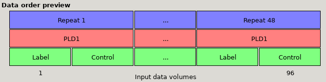
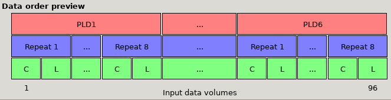
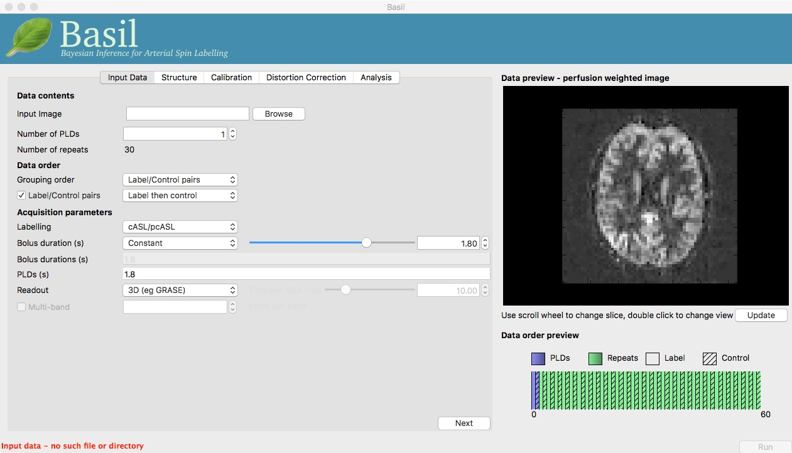
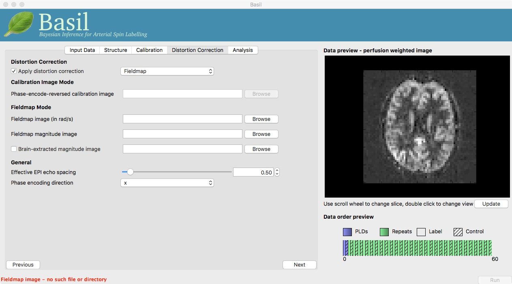

==============
GUI User Guide
==============

The graphical user interface to the BASIL tools can be accessed by typing ``asl_gui`` at the command line. It should provide most of the options required 
for analysis of ASL data inlcuding the majority of the more advanced features of BASIL.

Note: if you are using a release of BASIL that you have installed separately from FSL you may need to specfically call ``asl_gui`` with the full path to
 where it is installed: e.g. ``/Users/{blah}/Downloads/oxford_asl/asl_gui``. This page documents the GUI avilable in FSL v6 (also available via the 
 pre-release website), there are some differences with the GUI found in FSL v5.

The GUI largely provides a more approachable interface to the ``oxford_asl`` command line tool (and even produces a command line call for ``oxford_asl`` 
for you to reuse separately if you like). 

The GUI has five tabs, whose function are fairly self-explanatory. Each tab represents one step in the (notional) workflow for your ASL analysis and you 
can work through them using the prev/next buttons in the lowe right of each tab. For many analyses you will be able to accept many of the default options
and you might find you do no need to even visit some of the later tabs.

- Input Data: Specify details of the ASL data here, this is also where oyu have to record details about the acquisition used.
- Calibration: Specify your calibration image (if you have one), to be used to produce images of absolute perfision (in ml/100g/min). You can also choose
  to set options relating to the method for estimation of the equilibrium magnetization of arterial blood.
- Structural: Specify a structural image, or the output of a previous run of ``fsl_anat``, to be used in the analysis process and for registration. 
  Analysis can proceed without a structural iamge, but if you have one it is recommeded that you include it.
- Distortion correction: If you have suitable images to do distortion correction of your ASL data you can include them here.
- Analysis: Options relating to the analysis, primarily the kinetic model and the estimation process.

More details on each tab are provided below. Note that some of the options available on each tab depend on what information is present in your data 
(set on the data tab). Thus your view of the tab might differ from the one shown here slightly.

Input Data
----------

.. image:: images/aslgui_data.jpg

**Data contents**

- *Input Image*:  A single 4D nifti file of the main ASL data (either label-control pairs or subtracted images), with the individual measurements 
  in the 4th dimension.
- *Numer of PLDs*: Set the number of post-label delays (or inversion times/inflow times) in the data.
- *Number of repeats*: A value will be calculated here based on the number of PLDs you entered in the box above. Use this is a sanity check again 
  the number of repeats you expect from your acquisition.

**Data order**

- Volumes grouped by: For multi-PLD data, this specifies whether the acquisition consisted of a full set of all PLDs, with the whole block repeated 
  multiple times (Volumes grouped by ``Repeats``), or if the first PLD was repeated multiple times, followed by all repeats of the second PLD, and so 
  on (Volumes grouped by ``TIs/PLDs``).

- Label/control pairing: This specifies whether the label image was before the control or vice versa, or if the data is already subtracted.

The choices selected here are reflected in the **data order preview** view, at the bottom right of the window. This gives a visual representation of
the volumes in the input data. The horizontal axis represents the sequence of volumes in your data, and the boxes above shows the PLD, repeat and
label/control corresponding to each volume.

Data preview for single-PLD data with ``Label then control`` ordering and 48 repeats. Note that the 'Volumes grouped by' option makes no practical
difference for single PLD data.

.. image:: images/aslgui_dataorder_preview2.png

Data preview for multi-PLD data with 6 PLDs, with ``Label then control `` ordering and volumes grouped by ``Repeats``. The first set of volumes 
contains a single repeat of all the PLDs, followed by another block of all PLDs, etc.

*Data preview for multi-PLD data with 6 PLDs, with ``Control then label `` ordering and volumes grouped by ``PLDs``. Note that the order of the 
label and control images (the green ``L`` and ``C`` boxes) has changed, and the first set of volumes is 8 repeats of PLD1, followed by 8 repeats
of PLD 2, etc.

**Acquisition parameters**

- *Labeling*: Choose the labelling scheme employed, either pcASL/cASL or pASL (note for analysis purposes there is no difference between cASL and pcASL).
- *PLD / TIs*: Set the post-labeling delay(s) (or inversion time(s)) for the acquisition. For a multi-PLD/TI acquisition there will be a value to be set for each PLD/TI in the data.
- *Bolus duration (s)*: The duration of the labeled bolus in seconds.

  [Advanced] If your data is multi-PLD you can additionally specify different bolus durations for the different PLD, by changing from *single* to *mulitple*. Using this option you can have any combination of PLD and bolus duration to match those used in the acquisition

- Readout: Specify if a full 3D or a 2D multi-slice acquisition was used. For 2D you should then set the time taken to acquire each slice (in miliseconds) as this determines the true PLD/TI for each slice.
- Multi-band: Inlcude this option where the readout was a multi-band (simultaneous multi-slice) 2D acquisition, in which case you need to specify the number of slices in each band, to correctly set the PLD/TI for each slice.

**Data preview - perfusion weighted image**

On the right of the window is a preview pane. Once you have set the *Data contents* and *Data order* parameters you can press *preview* and the GUI will generate a perfuion-weighted 
image based on the information you have provided. This is a good sanity check to ensure that you have set these parameters correctly - if at this stage you dont see something that 
looks like a perfusion-weighted image - i.e., something in which the grey matter structure of the brain is evident - then you probably haven't set the ordering correctly. You can 
scroll through the slices in the image using your mouses' scroll wheel (or equivalent). Note that for multi-PLD data this preview averages all the different PLD.

Structural
------------

- *Use FSL_ANAT output*: Recommended, use the output for a previous ``fsl_anat`` analysis to obtain stuctural image information.
- *Use Structural Image*: Supply a high-resolution structural image (only if above option is deselected).
- *Brain extraction*: Supply a brain extracted version of the structural image or request an ``fsl_anat`` analysis to be run for brain extraction.
- *Transform to standard space*: Provide a linear matrix (``flirt``) or warp (``fnirt``) from structural image to standard space. Only required if an ``fsl_anat`` output is not available and results are required in standard space.
  
Calibration
-----------

.. image:: images/aslgui_calib.jpg

**Enable Calibration**

Note you specfically have to chose the option to enable calibration. It is possible to perform ASL analysis without calibration, but only then posisble to get relative perfusion images.

- *Calibration image*: An image to be used for calibration. This should have the same resolution as the ASL data, ideally have the same readout, and be proton density weighted.
- *M0 type*: Specify what sort of calibration image you are supplying. In most cases this will be *Proton Density*, unless you have data with a pre-saturation in which case chose *saturation recovery*.
- *Sequence TR (s)*: The repetition time of the sequence used to colelct the calibration image (this may not be the same as the ASL data itself). This is used to correct for non-equilibrium effects on the PD image.
- *Calibration gain*: If there is a difference in acquisition gain between the calibration image and the ASL data it can be set here. This might be the case where background suppression has been applied for the main ASL data.
- *Calibration mode*: Chose either to compute and apply the calibration factor (equilibirum magnetization of arterial blood) *voxelwise*, or from within a *Reference Region*. The latter relies upon a structural image being provided (unless you supply your own mask for this below), the former is the approach assumed by the white paper.

**Reference tissue**

These options apply to the *Reference Region* mode of calibration.

- *Type*: The reference tissue type to use, one of: *CSF/white matter/grey matter/none*. For the first three options a mask will be generated automatically from the structural image (if you have specfied one), otherwise (or alternatively) you should specify your own mask in the *Reference Tissue Mask* box (this should be in the same space as the ASL data). Generally CSF or white matter are good choices, avoid grey matter due to partial volume effects.
- *Sequence TE*: This corrects for T2 differences between the reference tissue and the brain tissue (using a blood T2 value) based on the TE of the data (which is assumed to be the same as any calibration image).
- *Reference T2/ Blood T2*: T2 values, these are only relevant if you specify the TE of your sequence. T2 of the reference deafults to a CSF value. These should be replaced by T2* values if appropriate.
- *Reference T1*: T1 of the reference tissue.
- *Coil Sensitivity Image*: Optionally inlcude an image of coil sensitivity to apply in the calibration process (same resolution as the ASL data). This is applicable where 'pre-scan normalise' or the equivalent hasn't been performed on the scanner when using parallel acquisition.

Distortion Correction
--------------------------------

- *Apply distortion correction*: Select to apply correction for readout distortions in the ASL data using a suitable set of reference images. You will need either a *calibration image* with a different phase encoding direction to the main calibration image, or a *fieldmap*.

*Calibration image mode*

- *Phase encode reversed calibration image*: An image that matches the calibration image in all acquisition parameters, except that the phase-encode direction is reversed.
- *Effective EPI echo spacing*: Set this value from the sequence in seconds (typical values are of the order of 0.1 ms).
- *Phase encode direction*: The phase encode direction of the calibration image (i.e. the image entered on the *Calibration* tab).

  Note that in this mode ``oxford_asl`` uses TOPUP_ to do the distortion correction. For this, the Effective EPI echo spacing is converted to total readout time by multiplication by the number of slices (minus one) in the encode direction.

.. _TOPUP: https://fsl.fmrib.ox.ac.uk/fsl/fslwiki/topup
  
*Fieldmap mode*

- *Effective EPI echo spacing*: Set this value from the sequence in seconds (sometimes called the dwell time), typical values are of the order of 0.1 ms.
- *Phase encode direction*: The phase encode direction of the calibration image (entered on the *Calibration* tab).
- *Fieldmap image*: A fieldmap image (need not necessarily matched to the ASL nor structural image resolution) in rad/s - be careful about the units, as this is not consistent between neuroimaging tools.
- *Fieldmap magnitude image*: A magntiude image to go with the fieldmap, this is used for registration of the fieldmap.
- *Brain extracted fieldmap magntiude image*: Brain extracted version of above image.

  For more information on fieldmapping see the documentation associated with FUGUE_ (note the fieldmap correction in the BASIL GUI is akin to using FEAT for fieldmap correction and uses ``epi_reg``, albeit in a way specfically setup for ASL data).

.. _FUGUE: https://fsl.fmrib.ox.ac.uk/fsl/fslwiki/FUGUE/Guide#SIEMENS_data

Analysis
--------

.. image:: images/aslgui_analysis.jpg

**Basic analysis options**

- *Output directory*: where to put the results.
- *Brain Mask*: BASIL will try to create a brain mask for you using the available data, you may specify your own mask here (in the same space as the ASL data).
- *Analysis which conforms to 'White Paper'*: sets kinetic model such that it mimics the assumptions made in the formula provided in the ASL consensus, 'white', paper.

**Inital parameter values**

This section sets parameter values for the kientic model. In some cases these are treated as initial and/or prior (mean) values, but are also estimated in the analysis itself.

- *Arterial Transit Time*: The assumed value for the ATT. For multi-PLD ASL, ATT is estimated from the data and this value is used as prior information, for single delay data this value will be treated as fixed. The default 0.7 appears to be reasonable for pASL, but longer values ~1.3s have been found to be more suitable for pcASL data, these are the defaults used by the GUI. (in *white paper mode* this value is set to 0)
- *T1/T1b*: T1 values for tissue and blood. Defaults are 1.65 seconds for blood and 1.3 seconds for tissue (based on 3T field strength). (In *white paper mode* both T1 values are set to 1.65 seconds).
- *Inversion efficiency*: A fixed value for the inversion efficiency applied in the calculation of absolute perfusion. The default values (0.85 for pcASL and 0.98 for pASL) are taken from the white paper.

**Analysis Options**

- *Adaptive spatial regularisation on perfusion*: applys a spatial prior to the perfusion image during estimation, thus making use of neighbourhood information. This is a highly recommended option, and is on by default.
- *Incorporate T1 uncertainty*: Permits voxelwise variability in the T1 values, this will primiarly be reflected in the variance images for the estimated parameters, dont expect accurate T1 maps from conventional ASL data.
- *Include macro vascular componet*: Corrects for arterial or macrovascular contamination, and it suitable where the data multi-PLD (even where flow suppresion has been applied).
- *Fix label duration*: Takes the value for the label duration from the *Input Data* tab as fixed, turn off to estimate this from the data (the value on the data tab will be used as prior information in that case). You are most likely to want to deslect the option for pASL data, particularly where QUIPSSII/Q2TIPS has not been used to fix the label duration.
- *Partial Voume Correction*: Correct for the different contributions from grey and white matter, and CSF to the perfusion image. This will produce separate grey and white matter perfusion maps.
- *Motion Correction*: Uses ``mcflirt`` to perform motion correction of the ASL data (and the calibration image).

  
Output
------

The outputs from the GUI are a perfusion image called ``perfusion.nii.gz``, which provides blood flow in relative (scanner) units, and an arrival time image called ``arrival.nii.gz`` for multi-PLD ASL. If a calibration image has been provided then a further image, ``perfusion_calib.nii.gz``, is also produced, which is a flow map in absolute units (ml/100g/min). Results in native ASL, structural and standard space will appear in the output directory within separate subdirectories. Where applicable transformation between spaces will also be saved, along with summary measures of perfusion in the ``native_space`` subdirectory if the structural information is availabe to calculate these.

If calibration was performed then a separate subdirectory will be created and will contain text file called ``M0b.txt`` that records the estimated M0 value from arterial blood if the reference region mode was use, otherwise an image will be supplied instead. For reference region calibration, if a manual reference tissue mask was not supplied then the automatically generated one will also be saved in as ``refmask.nii.gz``, you should inspect this to ensure that it is a reasonable mapping of the tissue you are using for the reference region (normally CSF in the ventricles).

